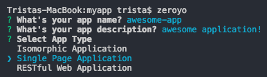
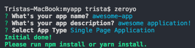

# Zeroyo
CLI tool for web application generator.

## Requirements
+ Node.js v8 or newer

## Installation

**npm**

    $ npm install tristachentw/zeroyo -g

**yarn**

    $ yarn add tristachentw/zeroyo global
## Usage

    $ zeroyo

**Select app type**

**Generated done !**

## Application Type
**Single Page Application**

+ ES6
+ Stylus
+ Combine image to single sprite
+ Webpack config for develope and production

**Isomorphic Application**

coming soon!

**RESTful Web Application**

coming soon!
